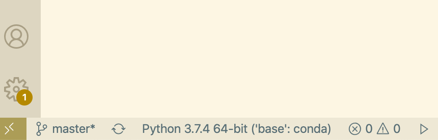

# Getting started guide

Long ago (before Jan. 1, 2020), there were two major versions of Python: 2 and 3.
But now, although it is possible to develop in Python 2, it isn't recommended (and in this class will actively be discouraged).
Python 2 is also being deprecated which means that the libraries you'll use will stop having active updates and support.

Python is a cross-platform programming language, which means it runs on all major operating systems.
Here, we'll make sure Python 3 is setup correctly on your computer, and have you run your first python script.

This guide will help you install both python and a code editor, and then test that the installation works as intended.

# Installing Python

Each OS comes with it's own flavour of Python and there are small details different to each OS.
To make sure that we all have a standard working environment, we will first install anaconda.
Anaconda is a bundled python environment which comes with a lot of Data Science & Machine Learning libraries and allows for easy installation of packages for your user only without needing admin privileges.

**Below is just general steps. Actual installation might differ slightly. Improvise, adapt, overcome**

If you find the steps contradictive, here's the top-level general succession that would work in 99% cases:

1. Download graphical 64-bit installer for your OS from [anaconda website](https://www.anaconda.com/products/individual)
2. Run the installer, install it for your local user, leave all settings on default
3. Test that you have python installed

Now, here's that same steps in more detail:

## Windows

### Installation

1. Download [Anaconda for Windows, v3.8](https://www.anaconda.com/products/individual#windows) and start installation. You will need a 64-Bit version (unless you explicitly know otherwise)
2. You might need to move the installer to different directory if Windows wouldn't let you start it from the Downloads folder.
3. Select “Just Me” during installation.
4. Select `C:\anaconda3` as your install directory. Windows could complain about the location, adjust it to some other place where you can write, just try keeping the full path to install directory as simple as possible (no spaces or special symbols in the name)
6. In the final screen before installation, check "Register anaconda3 as my default Python3.8 installation".

### Verifying installation

1. In your start menu, search for *Anaconda Prompt* and open it. Type `python` and press enter to get your Python prompt.
2. You should see a `>>>` symbol. This symbol is called *the prompt* and it indicates that the computer is ready to accept our input. It is here that we'll type our python code. **If you see a C:\User\..** something (that is, a regular _windows_ prompt), type `python` to get to the _python_ prompt.
3. Type `print("Hello World!")` and you should see the output!

### Troubleshooting

- For the complete install instructions, [click here](https://docs.anaconda.com/anaconda/install/windows/).
- If you're still having problems, please check with your instructor.

## MacOS
Python is already installed on most Macs.
However, it's a non-standard setup so we'll re-install python using anaconda.

### Installation

1. Download [Anaconda for MacOS, v3.8](https://www.anaconda.com/products/individual#macos) and start installation by double-clicking the downloaded file. It's better to **download Graphical Installer** unless you know what you're doing.
2. On the *destination select* screen, choose *Install for me only*.
3. On the *Installation Type* screen, click on *Change Install Location*.
4. If prompted, set the install location to `~/anaconda3`, otherwise just proceed (but make sure you selected "install for me only").
5. During the installation, you will be asked *“Do you wish the installer to initialize Anaconda3 by running conda init?"*. Answer *yes* to this question.

If installer hangs at some point while saying that it seemingly "only a minute left", just a bit longer. If the problem stays, try connecting/disconnecting/reconnecting to/from VPN.

### Verifying installation

1. Open spotlight: Press ⌘ + Space
2. Search for `iTerm` (alternatively `Terminal` if you don't have `iTerm` installed).
3. You should see a `➜` or `>>>` symbol. This symbol is called *the prompt* and it indicates that the computer is ready to accept our input. Type `python` on the prompt to launch the Python shell.
4. You should see a `>>>` symbol. This again indicated that the Python shell is ready to accept our inputs and it's here that we'll type our python code.
5. Type `print("Hello World!")` and you should see the output!

### Troubleshooting

- For the complete install instructions, [click here](https://docs.anaconda.com/anaconda/install/mac-os/).
- If you're still having problems, please check with your instructor.

## Ubuntu/Debian

### Installation
1. Open Terminal (`Ctrl + Alt + T`).
2. Go to your downloads folder: `cd ~/Downloads`.
3. Download anaconda: `wget https://repo.anaconda.com/archive/Anaconda3-2020.02-Linux-x86_64.sh`.
4. Run the file: `bash Anaconda3-2020.02-Linux-x86_64.sh`.
5. When the installer asks for installation location, type `~/anaconda3` if it's not the default.

### Verifying installation

1. Close and reopen the terminal.
2. Type `python` on the prompt.
3. You should see a `>>>` symbol. This symbol is called *the prompt* and it indicates that the computer is ready to accept our input. Type `python` on the prompt to launch the Python shell.
4. Type `print("Hello World!")` and you should see the output!


# Installing a text editor

Programming is about writing text about just as much as computer science is about computers - that is to say: not very much. However, putting text down efficiently, being able to manipulate the text without having to think about is crucial to not having your chain of thought disrupted.
Aside from that, a good text editor helps you in several ways:
- Jumping to definition of a function defined in a different file
- Code debugging write within the editor
- Code refactoring
- Manipulating text a lot more efficiently vs just normal Copy and Paste
- Linting: Showing when you're writing incorrect code/writing code in a bad style
- Etc.

You don't need to worry about this all this just now. However, we want to start you off with a text editor that easy to get started with but is very powerful and can grow with you: [Visual Studio Code](https://code.visualstudio.com/)

## Windows

1. Download the [Visual Studio Code installer for Windows](https://go.microsoft.com/fwlink/?LinkID=534107).
2. Once it is downloaded, run the installer (`VSCodeUserSetup-{version}.exe`).
3. On the *Select Additional Tasks* screen, make sure to check:
    - Create desktop icon
    - Add "Open with code" to windows file explorer file context menu
    - Add "Open with code" to windows file explorer directory context menu
    - Register code as an editor for supported file types
    - Add to PATH
4. By default, VS Code is installed under `C:\users\{username}\AppData\Local\Programs\Microsoft VS Code`. This setup doesn't need admin privileges.

Open and check VSCode to see whether the installation was successful:
- Go to desktop and double click VSCode icon
- VSCode should open

Note: If you are having trouble starting VSCode, your .NET Framework might be old. You need to update it. 
- Check which version you have by running `reg query "HKEY_LOCAL_MACHINE\SOFTWARE\Microsoft\NET Framework Setup\NDP\v4\full" /v version` in the command line (Start menu > search for `cmd` > open > paste the command)
- If your .NET version is old, download and install the latest version from 


## MacOS

1. Download [Visual Studio Code for macOS](https://go.microsoft.com/fwlink/?LinkID=534106)
2. Open the browser's download list and locate the downloaded archive
3. Select the 'magnifying glass' icon to open the archive in Finder
4. Drag Visual Studio Code.app to the Applications folder, making it available in the macOS Launchpad
5. Add VS Code to your Dock by right-clicking on the icon to bring up the context menu and choosing Options, Keep in Dock

Open and check VSCode to see whether the installation was successful:
- Open spotlight (⌘ + Space)
- Start search for VSCode by typing *visual studio code*. You should see Visual Studio Code in the dropdown list
- Press Enter to open VSCode

To make VSCode launchable from the command line:
- Open VSCode from dock or from spotlight (⌘ + Space)
- Open the Command Palette (⇧⌘P) and type 'shell command' to find the *Shell Command: Install 'code' command in PATH* command.
- Restart the terminal for the new $PATH value to take effect. You'll be able to type 'code .' in any folder to start editing files in that folder

## Linux

- If you have *snap* installed, then run
```bash
sudo snap install --classic code
```
- If you don't have *snap*, [download the deb archive](https://go.microsoft.com/fwlink/?LinkID=760868), navigate to the download directory in terminal (`cd ~/Downloads`) and run
```bash
sudo apt install ./<file>.deb
```

Open and check VSCode to see whether the installation was successful:
- On a terminal, type `code` to launch VSCode
- Or, you can also find VSCode in the launcher


## Install Python VSCode extension (Windows/Mac/Linux)
- Click on the Extensions Icon on the left sidebar. It looks like this:


- In the search bar, search for Python
- Click *Install*
- Choose Select Python Interpreter and select the anaconda python you just installed at the Path `~\anaconda3\python.exe`, name should be something like `Python 3.8.8 64-bit ('base': conda)`.

# Running the Hello World Program from within VSCode
- Make a folder called `python_work` somewhere on your system for your projects. (It’s best to use lowercase letters and underscores for spaces in file and folder names, because these are Python naming conventions)
- Open VSCode
- Make a new file (*⌘/Ctrl + N* or *File > New File*) and save it as `hello_world.py` in your `python_work` folder
    - The `.py` file extension is used for all python files
    - It allows you to directly open the file in VSCode
    - It also allows VSCode to detect that this is a python program and enable all python specific features in the editor
- After you’ve saved your file, enter the following line:
```
print("Hello World!")
```
- To check whether the python interpreter (that we installed earlier) has already been recognized by VSCode, look at the lower left corner of the screen and find the status bar. You should see something like this:



- See the `Python 3.8.8 64-bit` line? That means VSCode knows where Python is installed
- If you don't see this information, you'll need to tell VSCode where to find Python. For this:
    - Open the *command palette* in VSCode:
        - Mac ⇧⌘P
        - Windows/Linux: Ctrl + Shift + P
    - Start typing: **Python: Select Interpreter** to search for the command
    - Select one of the options shown to you which has `conda` in the name
​

If nothing python-related shows up when you start typing, make sure you installed that python VSCode extension.

## Running Hello World Program
You should now be able to run your program successfully. Run hello_world.py by selecting *Run > Run without debugging* (you'll also be able to see the shortcut you can use to do this the next time - it's *Ctrl + F5* on all systems)

In the terminal, you'll see something like the following output​

```
$ cd /Users/john.doe/tmp/python_work ; env python /Users/john.doe/.vscode/extensions/ms-python.python-2020.6.89148/pythonFiles/lib/python/debugpy/launcher 52156 -- /Users/john.doe/tmp/python_work/hello_world.py

Hello world!
```

The first line is just VSCode setting up the python environment correctly and executing the file from the CLI. The second line is the output of the program!
​
If you don't see this, or if you have problems anywhere else during this setup, don't hesitate to contact Prasoon. 
​
## Running Python Programs from a Terminal
Most of the programs you write in your text editor you'll run directly from the editor, but sometimes it's useful to run programs from a terminal instead. For example, you might want to run an existing program, without opening it for editing.
​

You can do this on any system with Python installed if you know how to access the directory where you stored the program file. To try this, make sure you've saved the `hello_world.py` file in the `python_work` folder on your desktop. 

​
Most of your programs will run fine directly from your editor, but as your work becomes more complex, you might write programs that you'll need to run from a terminal.
​
### On OS X/Linux
The terminal command `cd` (change directory), is used to navigate through your file system in a terminal session. The command `ls` (list), shows you all the nonhidden files that exist in the current directory. Open a new terminal window:
- For Mac: spotlight > iTerm, or if you already have the terminal open, ⌘T
- For Linux: Ctrl + Shift + T or search terminal in launcher

Then, issue the following commands to run `hello_world.py`:
```
cd Desktop/python_work/ 
ls
python hello_world.py
```
The first command navigates to your work folder which is in the Desktop folder. The next command lists the files and directories within that folder. Finally, we run the python script using the commend `python hello_world.py`
It's that simple. You just use the python3 command to run python programs.
​
### On Windows
The terminal command `cd` (change directory), is used to navigate through your file system in a terminal session. The command `dir` (directory listing), shows you all the nonhidden files that exist in the current directory.
Open a new terminal window (start *Anaconda Prompt* from start menu) and issue the following commands to run `hello_world.py`:
```
cd Desktop\python_work
dir
python hello_world.py
```
The first command navigates to your work folder which is in the Desktop folder. The next command lists the files and directories within that folder. Finally, we run the python script using the commend `python hello_world.py`

​
# Other useful connection options
While running a script, either from a terminal or from a text editor is a great way to develop, sometimes you want the flexibility of being able to run small snippets of code and seeing the output with lower overhead. 
​
We're going to give you two options: jupyter notebooks and the ipython extension. 
​
## Jupyter Notebook
Jupyter notebooks are an open-source, interactive web application that allows you to write and run code in a number of languages. It has become almost the defacto means of developing code in Python, especially in Data Science. 
​
Jupyter comes pre-installed when you install anaconda so we don't need to install it manually.​

Open a terminal (or use the one you still have open from above) and enter the following command:
```
jupyter notebook
```
This should open a jupyter notebook within your web browser. 
​
If there are problems, contact your instructor.
​
## IPython
IPython provides a python session that is interactive. It's worth having for the text completion. IPython also comes preinstal​led with anaconda.

Now when you want to test python quickly run the following in your terminal:
```
ipython
``` 
which will spin up an interactive python session. 
​
# Final thoughts on setup
If this was hard, or you struggled, please don't worry. Some of this setup is tricky. We wanted to take the time this week to make sure everyone is set up correctly, so when we start working on projects next week we're all on the same page/system. 
​
Feel free to reach out to any of the instructors, and we'll find the time to sit down and get you set up correctly.
