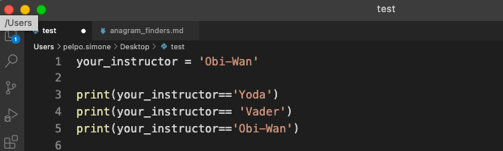

## If Statements
Programming often involves examining a set of conditions and deciding which action to take based on those conditions. Python’s if statement allows you to examine the current state of a program and respond appropriately to that state.

### Conditional Tests
At the heart of every if statement is an expression that can be evaluated as True or False and is called a conditional test. Python uses the values True and False to decide whether the code in an if statement should be executed. If a conditional test evaluates to True, Python executes the code following the if statement. If the test evaluates to False, Python ignores the code following the if statement.

#### Checking for Equality
Most conditional tests compare the current value of a variable to a specific value of interest. The simplest conditional test checks whether the value of a variable is equal to the value of interest.

Let's say your instructor's name is "Obi-Wan Kenobi", or "Obi-Wan" for short. In you script file, you can create a variable to store this information:
```python
your_instructor = 'Obi-Wan'
```

Now we can _test_ the variable and do our first conditional check by adding to the script file the following comparisons lines between your variable and a couple of strings:
```python
print(your_instructor== 'Yoda')
print(your_instructor== 'Vader')
print(your_instructor== 'Obi-Wan')
```



After running your script from the terminal, you should note how you would get either a boolean type `True` or `False` from python, depending on whether the condition is correct or not.

The first line above sets the value of the variable `your_instructor` to the string 'Obi-Wan'. From line 2 to 4 you'll notice that instead of a single `=` we have two `==`. This is important, because comparison is a different operation and we need to distinguish them from regular `=` operation. Here, instead of setting our variable, we're asking if the variable is equal to the string. Python should return `True` or `False` depending on the check and would return `True` **only** if the string we compare to is 'Obi-Wan' (and `False` for any other string).

If instead you want to know if it's _not equal_, just add `!=`. Try it by changing line 2 in the script above to `your_instructor != 'Yoda', and see what you get - remember to save the file and before running it on the terminal.

Testing for equality (or inequality as the case may be), is case senstive in Python, i.e. comparing two strings also checks for character format, _A_ is not equal to _a_. But remember from working with strings we know how to handle that. Try to make the script below return `TRUE` when testing for equality at line 3 - copy lines below and paste them in a new VSCode file, then run it on terminal after saving it:
```python
your_instructor = 'Obi-Wan'
# REPLACE THIS COMMENT WITH CODE TO FIX THE CASE SENSITIVE PROBLEM
print(your_instructor == 'OBI-WAN')
```


If you have trouble with this, ask your instructor (they are happy to help!).

Above we're working with strings, but the same applies for numerical comparisons. But you can expand numerical comparisons to include various mathematical conditional statements - copy lines below and paste them in a new VSCode file, then run it on terminal after saving it:
```python
age = 30
print(age < 29)
print(age <= 29)
print(age > 29)
print(age >= 29)
```
If this is your first time coding the above mathematical conditional statements, take the time to write out what each conditional is checking for. 

### Checking if an item is in a list
Sometimes it’s important to check whether a list contains a certain value before taking an action. For example, you might want to check whether a new username already exists in a list of current usernames before completing someone’s registration on a website. In a mapping project, you might want to check whether a submitted location already exists in a list of known locations.
To find out whether a particular value is already in a list, use the keyword `in` - copy lines below and paste them in a new VSCode file, then run it on terminal after saving it:
```python
my_favorite_numbers = [8, 10, 20, 2, 6]
print(my_favorite_numbers)
print(9 in my_favorite_numbers)
print(8 in my_favorite_numbers)
```

## For loops
You’ll often want to run through all entries in a list, performing the same task with each item. For example, in a game you might want to move every element on the screen by the same amount, or in a list of numbers you might want to perform the same statistical operation on every element. Or perhaps you’ll want to display each headline from a list of articles on a website. When you want to do the same action with every item in a list, you can use Python’s for loop.
Let’s say we have a list of magicians’ names, and we want to print out each name in the list. We could do this by retrieving each name from the list individually, but this approach could cause several problems. For one,
it would be repetitive to do this with a long list of names. Also, we’d have to change our code each time the list’s length changed. A for loop avoids both of these issues by letting Python manage these issues internally.
Let’s use a for loop to print out each name in a list of magicians - copy lines below and paste them in a new VSCode file, then run it on terminal after saving it:

```python
magicians = ['Harry Houdini', 'David Copperfield', 'Penn Jilette'] 
for magician in magicians:
    print(magician)
```

Because looping is so integral to working in python, we'll take a little closer look at what's happening in this loop by explaining code line by line.

```python
for magician in magicians:
```

This line tells Python to retrieve the first value from the list magicians and store it in the variable magician. This first value is 'Harry Houdini'. Python then reads the next line:

```python
print(magician)
```

Python prints the current value of magician, which is still 'Harry Houdini'. Because
the list contains more values, Python returns to the first line of the loop:

```python
for magician in magicians:
```

Python retrieves the next name in the list, 'David Copperfield', and stores that value
in magician. Python then executes the line:

```python
print(magician)
```

Once there are no more values are in the list, Python moves on to the next line in the program. In this case nothing comes after the for loop, so the program simply ends.
When you’re using loops for the first time, keep in mind that the set of steps is repeated once for each item in the list, no matter how many items are in the list. If you have a million items in your list, Python repeats these steps a million times—and usually very quickly.
Also keep in mind when writing your own for loops that you can choose any name you want for the temporary variable that holds each value in the list. However, it’s helpful to choose a meaningful name that represents a single item from the list. For example, here’s a good way to start a for loop for a list of instructors, a list of dogs, and a general list of items:

```python
for instructor in instructors:
for dog in dogs:
for item in list_of_items:
```

Feel free to make these lists and practice looping through lists. For bonus, do something to each of the strings or items in your list and put them in a new list.

What happens once a for loop has finished executing? Usually, you’ll want to summarize a block of output or move on to other work that your program must accomplish.
Any lines of code after the for loop that are not indented are executed once without repetition. Let’s write a thank you to the group of magicians as a whole, thanking them for putting on an excellent show. To display this group message after all of the individual messages have been printed, we place the thank you message after the for loop without indentation - copy lines below and paste them in a new VSCode file, then run it on terminal after saving it:

```python
magicians = ['Harry Houdini', 'David Copperfield', 'Penn Jilette'] 
for magician in magicians:
    print(magician)

print("Wow what a great group of magicians!")
```

Because the last print statement is not indented it will only print once. 


### Adding if to a loop
We can add if to the start of loops to check conditions before proceeding. You can put any conditional test in the first line and just about any action in the indented block following the test. If the conditional test evaluates to True, Python executes the code following the if statement. If the test evaluates to False, Python ignores the code following the if statement - copy lines below and paste them in a new VSCode file, then run it on terminal after saving it:
```python
magicians = ['Harry Houdini', 'David Copperfield', 'Penn Jilette'] 

user = 'Prasoon'

if user not in magicians:
    print("Sorry, " + user + " is not a magician")

for magician in magicians:
    print(magician)

print("Wow what a great group of magicians!")
```
Indentation plays the same role in if statements as it did in for loops. All indented lines after an if statement will be executed if the test passes, and the entire block of indented lines will be ignored if the test does not pass.
You can have as many lines of code as you want in the block following the if statement. 

### if-else statement
Often, you’ll want to take one action when a conditional test passes and a different action in all other cases. Python’s if-else syntax makes this possible. An if-else block is similar to a simple if statement, but the else statement allows you to define an action or set of actions that are executed when the conditional test fail - copy lines below and paste them in a new VSCode file, then run it on terminal after saving it:
```python
magicians = ['Harry Houdini', 'David Copperfield', 'Penn Jilette'] 

user = 'Prasoon'

if user not in magicians:
    print("Sorry, " + user " is not a magician")
else:
    for magician in magicians:
        print(magician)

    print("Wow what a great group of magicians!")
```
If the conditional test passes, the first block of indented print statements is executed. If the test evaluates to False, the else block is executed.

Now, by changing the string assiociated with the `user`, try to make the code run the if statement block first, and the else statement block in a second run of the program.

# Project: Finding Single-Word Anagrams
An anagram is a word formed by rearranging the letters of another word. For example, Elvis yields eerie, trio, evils, lives, and veils. Does this mean Elvis still lives but veils his evil existence? 
Here first you’ll find all the anagrams for a given word or name. Then, you’ll write a program that lets a user interactively build an anagram phrase from their own name. 

Let's start by analyzing simple single­word anagrams and figuring out how to identify them programmatically. For this project you’ll load in a file full of words called 2of4brif.txt. It's included in the stash repository (or ask your instructor for help).

N.P.: to get the full path of your file, simply drag and drop the file icon into the terminal window. Terminal should print the full path of your file, so that you can copy and paste by replacing it below where it says `{path to your file}`,

Copy lines below and paste them in a new VSCode file:

```python
with open('{path to your file}') as in_file:
    word_list = in_file.read().strip().split('\n')
    word_list = [x.lower() for x in word_list]
    print(word_list)
```
Now let's set up an empty list for us to store our new anagrams into - copy line below and paste it to the newly created file:
```python
anagram_list = []
```
Now the program needs to verify that two strings are anagrams of each other. Python doesn’t contain a built­in anagram operator, but you can easily write one. Let’s look at an example. Pots is an anagram of stop, and you can verify that stop and pots have the same number of letters with the len()function. But there’s no way for Python to know whether two strings have the same number of any single character—at least not without converting the strings to another data structure or using a counting function. So, instead of looking at these two words simply as strings, you can represent them as two lists containing single­character strings - copy lines below and paste them to the newly created file:
```python
word = list('stop')
print(word)
anagram = list('pots')
print(anagram)

print("Testing if " + word "is anagram of " + anagram)
print(word==anagram)
```
if we try `word==anagram` Python is going to tell us `False`. That's because (you'll recall), lists are ordered. The two are not equal, even though they have the same list items, because the order is wrong. So we'll sort them - copy lines below and paste it in the newly created file:
```python
word = sorted(list('stop'))
print(word)
anagram = sorted(list('pots'))
print(anagram)
word == anagram
```
Now that we have a way to find anagrams, run this script in a new empty file called `anagram_finder.py`:
```python
#Input a single word (hint, make sure it's a string)
lookup_word = 'put in your word here'.lower()
clean_word = sorted(lookup_word)
anagram_list = [lookup_word]  # any word is an anagram of itself
for word in word_list:
    if word.lower() != lookup_word:
        if sorted(word) == clean_word:
            anagram_list.append(word)
```
Now all we need to do is print out the list of anagrams outside the for loop, as long as there's more than one word in the list - copy lines below and paste them in the newly created file `anagram_finder.py`:
```python
if len(anagram_list) <= 1:
    print("You need a new word, this one has no anagrams")
else:
    print("Anagrams = " + anagram_list)
```
Alright, we've covered a lot today! But if you're thirsty for more challenge, try one of the below:
* Make a list of five or more usernames, including the name 'admin'. Imagine you are writing code that will print a greeting to each user after they log in to a website. Loop through the list, and print a greeting to each user:
If the username is 'admin', print a special greeting, such as Hello admin, would you like to see a status report?
Otherwise, print a generic greeting, such as Hello Eric, thank you for logging in again.
* Ordinal numbers indicate their position in a list, such as 1st or 2nd . Most ordinal numbers end in th, except 1, 2, and 3. Store the numbers 1 through 9 in a list. Loop through the list. Use an if-elif-else chain inside the loop to print the proper ordinal ending for each number. Your output should read "1st 2nd 3rd 4th 5th 6th 7th 8th 9th", and each result should be on a separate line.