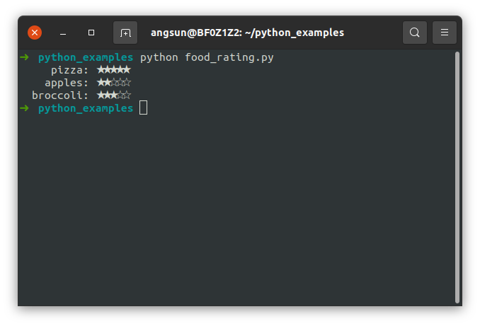
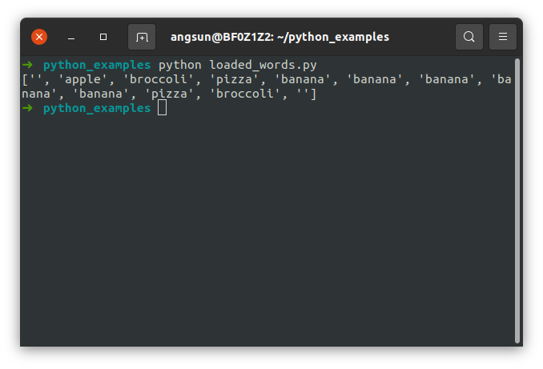

# Dictionaries

Python's dictionaries allow you to connect pieces of related information. A dictionary in Python is a collection of
key-value pairs. Each key is connected to a value, and you can use a key to access the value associated with that key.
A key’s value can be a number, a string, a list, or even another dictionary. In fact, you can use any object that you
can create in Python as a value in a dictionary. In Python, a dictionary is wrapped in braces, {}, with a series of
key-value pairs inside the braces:

```python
# Starting out with an empty dictionary
instructor_0 = {}

# Or creating a dictionary with (some) data already defined
instructor_0 = {'competence': 'data science', 'domain': 'App', 'location': 'Berlin'}

# Be careful though, as {} is also used for declaring sets, don't forget your colons
# when creating dictionaries!
not_a_dictionary = {"foo", "bar"}
```

A key-value pair is a set of values associated with each other. When you provide a key, Python returns the value
associated with that key. Every key is connected to its value by a colon, and individual key-value pairs are separated
by commas. You can store as many key-value pairs as you want in a dictionary.

## Accessing values in a dictionary

To get the value associated with a key, give the name of the dictionary and then place the key inside a set of square
brackets, as shown here:

```python
instructor_0 = {'competence': 'data science'}
print(instructor_0['competence'])
```

This returns the value associated with the key 'competence' from the dictionary instructor_0: 'data science'

You can have an unlimited number of key-value pairs in a dictionary. For example, here’s the original instructor_0
dictionary with three key-value pairs:

```python
instructor_0 = {'competence': 'data science', 'domain':'App', 'location':'Berlin'}
```

Try making a dictionary to represent you. Use the variable name `student_0` and keep all the keys the same. Since I'm
the only one in the class who is a data scientist in the App domain, I'm going to assume you'll need to change the
values for each key. If you have questions or problems, let your instructor know.

## Adding new key-value pairs

Dictionaries are dynamic structures, and you can add new key-value pairs to a dictionary at any time. For example,
to add a new key-value pair, you would give the name of the dictionary followed by the new key in square brackets
along with the new value.

Let’s add two new pieces of information to the `student_0` dictionary: office and team name. I'll use the
`instructor_0` as an example:

```python
instructor_0['office'] = 'G16'
instructor_0['team'] = 'Shopping-Risk'

print(instructor_0)
```

The final version of the dictionary contains five key-value pairs. Notice that the order of the key-value pairs does
not match the order in which we added them. Python does not care about the order in which you store each key-value pair;
it cares only about the connection between each key and its value.

## Modifying values in a dictionary

To modify a value in a dictionary, give the name of the dictionary with the key in square brackets and then the new
value you want associated with that key. For example, consider an instructor that changes teams as the class progresses:

```python
instructor_0 = {'team' : 'Shopping-Risk'}

print(f"The instructor is in {instructor_0['team']}.")

instructor_0['team'] = 'Ghostbusters'
print(f"The instructor changed to {instructor_0['team']}.")
```

## Checking for the existence of keys in a dictionary

The special `in` operator can be used to check if a key is present in the dictionary:

```python
spring_months = {"march": 31, "april": 30, "may": 31}
print("Is september a spring month?", "september" in spring_months)
print("Is may a spring month?", "may" in spring_months)
```

It can be used inside loops as well:

```python
q1_months = ["february", "march", "april"]
spring_months = {"march": 31, "april": 30, "may": 31}
for month in q1_months:
    print("Consider", month, "for example!")
    if month in spring_months:
        days = spring_months[month]
        print(f"It's a spring month, and it has a whole {days} days of spring")
    else:
        print("It's not a spring month! Annoying")
```

### Removing Key-Value Pairs

When you no longer need a piece of information that’s stored in a dictionary, you can use the del statement to
completely remove a key-value pair. All del needs is the name of the dictionary and the key that you want to remove.

For example, let’s remove the key 'location' from the student_0 dictionary along with its value.

```python
del student_0['location']
print(student_0)
```

Be careful/aware that the key-value pair is removed permanently. Try running the code above again, and see what error
you'll get.

### Looping through all key-value pairs

You can access any single piece of information about instructor_0 based on what you’ve already learned in this section.
But what if you wanted to see everything stored in this instructor's dictionary? To do so, you could loop through the
dictionary using a for loop:

```python
for key, value in instructor_0.items():
    print("\nKey: " + key)
    print("Value: " + value)
```

As shown, to write a for loop for a dictionary, you create names for the two variables that will hold the key and value
in each key-value pair. You can choose any names you want for these two variables. The second half of the for statement
auto-includes the name of the dictionary followed by the method items(), which returns a list of key-value pairs. The
for loop then stores each of these pairs in the two variables provided. In the preceding example, we use the variables
to print each key v, followed by the associated value w. The "\n" in the first print statement ensures that a blank line
is inserted before each key-value pair (remember last week's work on strings? when we touched on this?).

We used names `key` and `value` in the example above, but it doesn't need to be named that. Use whatever appropriate
for the context, for example:

```python
my_food_ratings = {'pizza': 5, 'apples': 2, 'broccoli': 3}
for food, rating in my_food_ratings.items():
    stars = "★" * rating
    blanks = "☆" * (5 - rating)
    print(f"{food:>10s}: {stars}{blanks}")
```

(the "`:>10s`" specifies that the string (`s`) should be aligned to the right `>` and occupy at least `10` characters)



Also, a bit of a nerdy note, but it used to be that python did not care about the order of items in the dict. However,
since python 3.6 the keys are stored in the same order that they were added. The general recommendation still holds:

* if you need some stuff in order, use lists
* if you just want to track connections between individual keys-value pairs, use dictionaries

> **Advanced reading**: If your use case requires the use of dictionaries that keep track of what order data was
> inserted, you can take a look at
> [OrderedDict](https://docs.python.org/3/library/collections.html#collections.OrderedDict) for pre 3.6 versions of
> Python. (Or if you do not wish to concern yourself with Python version and do it for compatibility reasons)

Now, let's write some code! We will focus on writing a word count script.

# Counting words using dictionary

We will find most common words in a document using a technique called a wordcount (often called "term frequency").
The idea is simple: we start by creating an empty dictionary, and count each word we encounter on each line of our
input file.

We will start small and iterate on it.

Assume we already loaded the file and it's a very silly and a short file, with one word per line, like this:

```
apple
broccoli
pizza
banana
banana
banana
banana
banana
broccoli
```

In python, multi-line strings are enclosed in triple-double-quotes `""" """` (or double triple-quotes `''' '''`), so
let's say we have it in a variable named `loaded_text`:

```python
loaded_text = """
apple
broccoli
pizza
banana
banana
banana
banana
banana
pizza
broccoli

"""
```

So we want our python code to help us process this multiline string and get a dictionary. The keys in this dictionary
would be encountered words, and the values would reflect how many times we saw that word in the text. Let's just count
the words ourselves and construct a dictionary by hand:

```python
counts = {"apple": 1, "broccoli": 2, "pizza": 2, "banana": 5}
```

Take a while to think how you got this and pretend that you're explaining to someone who is very good at following
instructions but very very very very very straightforward and eager to do anything, as long as it is expressed in
understandable manner. I'm talking about a python interpreter, of course! Take a few moments to think of how would you
express it in plain English.

Here's what you might end up with:

* take a `separate piece of paper` to track counts
* go over every `word` in the `loaded_text`
* if this is a new `word`, write it down on a `separate piece of paper` and put one `X` mark next to it
* if this `word` already is on the `separate piece of paper`, put another `X` mark next to it
* When there done reading the text and are no new `word`s, the `separate piece of paper` would have all the words in the
  text and their counts as number of `X` marks.

Let's try expressing it in python:

```python
separate_piece_of_paper = {}
for word in loaded_text:
    if word in separate_piece_of_paper:
       separate_piece_of_paper[word] = separate_piece_of_paper[word] + "X"
    else:
       separate_piece_of_paper[word] = "X"
print(separate_piece_of_paper)
```

Take a pause to match this code with our "instructions" above.

Let's put it all together and drop the paper metaphor:

```python
loaded_text = """
apple
broccoli
pizza
banana
banana
banana
banana
banana
pizza
broccoli
"""

counts = {}
for word in loaded_text:
    if word in counts:
       counts[word] = counts[word] + 1
    else:
       counts[word] = 1
print(counts)
```

Run this code. What do you observe?

There are at least two issues we didn't take into account:

1. Our script has no idea what a "word" is
2. We are not interested in counting any linebreaks (or empty words for that matter)

We need to teach our script how to process the input text word-by-word. The sort of string tricks we are going to use is
usually called "string manipulation". Since strings are very common in everyday world, all languages have some sort of
ways to do those string tricks. In our word count task we are interested in "splitting" operation, which we will use to
go from one word to another

## Splitting a string

The splitting operation can be used with any string. It changes this string into a list of strings.

This code:

```python
"python is the best second language for anything".split(" ")
```

would transform the string into a list

```python
["python", "is", "the", "best", "second", "language", "for", "anything"]
```

As you probably guessed, the string `" "` inside the brackets is the separation string. For our purposes the space is
what we want, but it can be anything actually. For example, this code:

```python
"is there anyone out there".split("there")
```

would give you this list:

```python
["is ", " anybody out "]
```

If we want to be super-strict and have an exact definition of this operation, it goes something like this:
the `split` operation _removes_ the string you _pass_ to it as a parameter and makes a list out of all parts that left.

So if we have this

```python
loaded_text = """
apple
broccoli
pizza
banana
banana
banana
banana
banana
pizza
broccoli
"""
```

Then we can turn it into list using a special symbol that indicates a line ending `"\n"`:

```python
loaded_words = loaded_text.split("\n")
print(loaded_words)
```



Let revise our set of instructions, including what both what we now know about `split()` and the numbers instead of
the `X` marks:

### Redefined algorithm

* take a `separate piece of paper` to track counts
* find all end of lines `\n` in the text, everything between them is a `word`
* go over every `word` in the text
* if this is a new `word`, write it down on a `separate piece of paper` and _set_ its count to `1`
* if this `word` already is on the `separate piece of paper`, _increase_ the count of with `word` by `1`
* When there done reading the text and are no new `word`s, the `separate piece of paper` would have all the words in
  the text and their counts as numbers

In python, this would be:

```python
loaded_text = """
apple
broccoli
pizza
banana
banana
banana
banana
banana
pizza
broccoli
"""
loaded_words = loaded_text.split("\n")

counts = {}
for word in loaded_words:
    if word in counts:
       counts[word] = counts[word] + 1
    else:
       counts[word] = 1
print(counts)
```

You might notice that we solved the issue with count the words and not the letters, but we still get empty words
(represented as `''` in our `counts` dictionary). Let's add another condition and just skip them:

```python
counts = {}
loaded_words = loaded_text.split("\n")
for word in loaded_words:
    if word == '':
        continue
    if word in counts:
       counts[word] = counts[word] + 1
    else:
       counts[word] = 1
print(counts)
```

Combine it all together and there you have it! A working word count implemented in pure python.

# DANGER ZONE

**everything below might look quite advanced**

We have covered what we need to do to count the words in a multiline string of lines, each line being a single word.
Consider a more complicated example:

```
apple pear banana
brocCOli pizza muFFin
pizza pizza
banana banAna
banaNA
baNAna
banAna
pizZa
```

This example has multiple words per line, and some words are spelled weirdly! We will have to adjust all the
words to make them count as similar (`pizzA` and `piZZa` would contribute to the same count)

We can adjust our algorithm and explain to it what is a line and how to get words from a line, OR we can just have
another algorithm to make it a single-word text first. Let's take the second approach just because we can.

We will have a new `loaded_lines` variable that will hold our initial lines. We then go through each line, splitting the
words and saving them in lowercase:

```python
loaded_lines = loaded_text.split("\n")
loaded_words = []
for line in loaded_lines:
    words = line.strip().split(" ")
    for word in words:
        loaded_words.append(word.lower())
```

This is our first loop inside a loop! Take a while to read this snippet of code above and ask your instructor if have
any questions, as it is very important that you understand all the things we do here.

Let's incorporate it to our word count script (notice that we not only added the lines->words but also moved and changed
the `loaded_words` line we had earlier):

```python
loaded_text = """
apple pear banana
broccoli pizza muffin
pizza pizza
banana banana
banana
banana
banana
pizza
"""

loaded_lines = loaded_text.split("\n")
loaded_words = []
for line in loaded_lines:
    words = line.strip().split(" ")
    for word in words:
        loaded_words.append(word)

counts = {}
for word in loaded_words:
    if word == '':
        continue

    if word in counts:
       counts[word] = counts[word] + 1
    else:
       counts[word] = 1
print(counts)
```

Okay, now we have only one thing left and that is to read that string of text from a file

## Counting words in a file

The trickiest part for the wordcount is dealing with the files and figuring out which words are the same. It is common
that reading data and preparing it for your algorithm is a separate skill, not necessary related to the "heavy lifting"
of the actual task at hand.

Let's take a look at what are we going to do:

1. We will start by reading the file contents in the string
2. We will loop over lines in the file, looping over words in lines and transforming every word we encounter into
   lowercase

It doesn't really matter if we use lowercase or uppercase, as long as we keep it the same for all words.

Here's the code that does the loading:

```python
loaded_words = []
with open('input.txt') as in_file:
    loaded_lines = in_file.read().strip().split('\n')
    for line in loaded_lines:
        words = line.strip().split(" ")
        for w in words:
            if w == '':
                continue

            word = w.lower()
            loaded_words.append(word)
```

After you run this, the `loaded_words` would contain all the words from the file `'input.txt'`. The file needs to be in
the same directory as the script. All words in the file will be transformed to lowercase. Example `input.txt` file can
be downloaded using this
[link](https://github.com/kamal8/python-course/blob/master/part3-word-counter/input.txt).

The `strip` operation removes all unnecessary noise from the string.

Now, as we have the `loaded_words` holding all the words, the rest should be clear. Combine the code we had written for
counting words and try running it. Once you got that, it's a good exercise to go line-by-line in your code and try to
think how that would sound in "normal words" if you were explaining it to someone.

Before running your code with a bigger file, to be absolutely sure you're doing it right, try this:

* run the code
* changing the words in your `input.txt` file: add or remove words, or change case of particular letters, or add blank
  lines, whatever
* run your code again to see if the result changes.

## Test your script with something real!

Finally, let's try a "real-world" file that contains some text. We've included a file that has the first couple of lines
from Charles Dickens's "A Tale of Two Cities":
[dickens.txt](https://github.com/kamal8/rossmo_formula/blob/master/part3-word-counter/dickens.txt). Make
sure it's in the same folder as the program you've built, and use it as you input file. How often does the word "season"
come up?

### Improvements on our word count script

If you still have some time and have some fuel left in you, let's think about ways to improve our word counting code.
You can do this as a mental exercise, if you're tired of typing and lay down your keyboard. It's a good idea to think
first before doing anyway, especially since we have something that's already somewhat working

We did a very basic wordcount, which can be easily improved.
Think of the "garbage words" like "a", "the", "and", "of", "to".
They are very common in any text!
What if we don't want to count them? Maybe we can have a way to ignore them? These words are generally called
_stopwords_, and they of course would differ from language to language. Can you find a list of stopwords for English?
What about other languages, like Spanish or French? Is their stopwords list longer or shorter?

How would you change your code to filter those words?

In the end we print all the words and their counts. What if we only want to print words that occur more than 10 times in
the text? How would the code change? At what section of your script would you change it?

Don't worry if you can't think of the code to answer/solve these questions, just try to think how would the logic
change. Once we get more tools in your belt, you will smash it with ease!

#### One more thing!

As we said earlier, string manipulations are very common, and most of the commonly-used languages provide a lot of ways
to alter strings. You can read more on what's provided out-of-the-box in python in terms of string manipulation in the
[docs](https://docs.python.org/3/library/stdtypes.html#string-methods). Reading language documentation is tough, though,
so don't stress it, but at least check the explanation on how `split` and `strip` work.

Here's one useful trick:

```python
line = "       this       is   a    string  "

words1 = line.split(" ")
print(words1)

words2 = line.split()
print(words2)
```

Run it, and check the result. Can this be used to simplify our word count code?

### Word-counting in the real world

Word counting itself is a token problem for many data-related problems. So you can say it's a classic one! For a
somewhat different approach in implementing the word count (including stopwords and some neat tricks in string
manipulations), see [here](https://programminghistorian.org/en/lessons/counting-frequencies).
