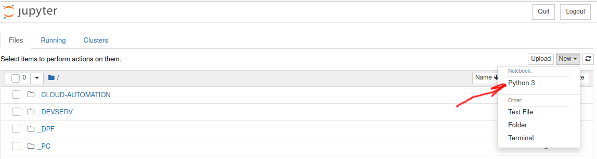
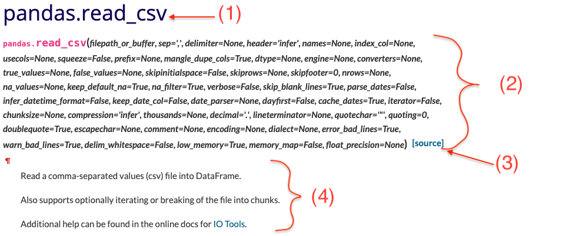

Jupyter Notebooks offer a good environment for using pandas to do data exploration and modeling, but pandas can also be used in text editors just as easily. Jupyter Notebooks give us the ability to execute code in a particular cell as opposed to running the entire file. This saves a lot of time when working with large datasets and complex transformations. Notebooks also provide an easy way to visualize pandas’ DataFrames and plots. As a matter of fact, this article was created entirely in a Jupyter Notebook. In this exercise we're going to be using jupyter notebooks exclusively.

**If you have anaconda installed, the preferred way is to launch a jupyter notebook from anaconda launcher**. Otherwise, using terminal you typically start notebook server with opening to your terminal and type:

```bash
jupyter notebook
```
This should spin up a notebook and open one in whatever your default web browser is. Keep this terminal open while you work with jupyter!
Find the button called "New" in the upper right part, click on it, and choose "Python 3" from the dropdown.
This will create a new jupyter notebook and open it.



The "Files" tab displays the contents of ther folder where you ran the `jupyter notebook` command inside the terminal. This will be a "root" directory for your notebooks and would be used as starting point when you accessing files from your notebook, so drop any .csvs there.

Let's make sure that Pandas is instaled. Open another terminal, and type this command:

```bash
conda install pandas
```

## Pandas
The pandas package is the most important tool at the disposal of Data Scientists and Analysts working in Python today. The powerful machine learning and glamorous visualization tools may get all the attention, but pandas is the backbone of most data projects.

Pandas has so many uses that it might make sense to list the things it can't do instead of what it can do.
This tool is essentially your data’s home. Through pandas, you get acquainted with your data by cleaning, transforming, and analyzing it.

For example, say you want to explore a dataset stored in a CSV on your computer. Pandas will extract the data from that CSV into a DataFrame — a table, basically — then let you do things like:

* Calculate statistics and answer questions about the data, like
    * What's the average, median, max, or min of each column?
    * Does column A correlate with column B?
    * What does the distribution of data in column C look like?
* Clean the data by doing things like removing missing values and filtering rows or columns by some criteria
* Visualize the data with help from Matplotlib. Plot bars, lines, histograms, bubbles, and more.
* Store the cleaned, transformed data back into a CSV, other file or database

Now that you have a jupyter notebook up and running, your first cell should import all the packages you want to use. 

For starters we want to use pandas:
```python
import pandas as pd
```
You can also just import pandas without the alias pd, but it's convention to shorten it.

### Core components of pandas: Series and DataFrames
The two primary classes of the pandas package are `Series` and `DataFrame` (note the way they are named, which tells us that it's a class!).

A `Series` is essentially a column, and a `DataFrame` is a multi-dimensional table made up of a collection of `Series`.

DataFrames and Series are quite similar in that many operations that you can do with one you can do with the other, such as filling in null values and calculating the mean.

### Creating a DataFrame from scratch

There are many ways to create a DataFrame from scratch, but a great option is to just use a simple dictionary.

Let's say we have a fruit stand that sells apples and oranges. We want to have a column for each fruit and a row for each customer purchase. To organize this as a dictionary for pandas we could do something like:

```python
data = {
    'apples': [3, 2, 0, 1], 
    'oranges': [0, 3, 7, 2]
}
```

And then pass this dictionary to the `DataFrame` class:

```python
purchases = pd.DataFrame(data)

purchases
```
Each (key, value) item in data corresponds to a column in the resulting DataFrame.

The Index of this DataFrame was given to us on creation as the numbers 0-3, but we could also create our own when we initialize the DataFrame.

Let's have customer names as our index:

```python
purchases = pd.DataFrame(data, index=['CJ', 'Prasoon', 'Mariia', 'Mihail'])

purchases
```

So, now we can locate a customer's order by using their name:

```python
purchases.loc['CJ']
```

That's a quick and easy way to load a dataset, but almost invariably you're going to need to load a dataset from other sources. For example: loading in a csv file. Here we're setting the index to be column zero, because we want the names to be the index. If you don't want that then just remove that part. Try it both ways here.

```python
df = pd.read_csv('purchases.csv')

df
```
different cell in your jupyter notebook:
 
```python
df = pd.read_csv('purchases.csv', index_col=0)

df
```

Alternatively, you can read data from a JSON:

```python
df = pd.read_json('purchases.json')

df
```
Notice this time our index came with us correctly since using JSON allowed indexes to work through nesting. Feel free to open `data_file.json` in a notepad so you can see how it works.

Pandas will try to figure out how to create a DataFrame by analyzing structure of your JSON, and sometimes it doesn't get it right. Often you'll need to set the orient keyword argument depending on the structure, so check out `read_json` [docs](https://pandas.pydata.org/pandas-docs/version/1.1.3/reference/api/pandas.read_json.html) about that argument to see which orientation you're using.

You can also convert back to a csv file, or json file by calling the method within the database class:

```python 
df.to_csv('new_purchases.csv')

df.to_json('new_purchases.json')
```

### Important DataFrame operations
DataFrames possess hundreds of methods and other operations that are crucial to any analysis. As a beginner, you should know the operations that perform simple transformations of your data and those that provide fundamental statistical analysis.

Let's load in the IMDB movies dataset to begin:

```python
movies_df = pd.read_csv("IMDB-Movie-Data.csv", index_col="Title")
```

Now let's start by viewing your data. This is almost always my first step of any analysis or machine learning. Most dataframes are bigger than the ones we built above, so rather than look at the whole data, let's just look at the first few rows. We'll do this using the head() method from our dataframe class. 

```python
movies_df.head()
```
By default, the `head()` method outputs the first five rows of data. But you can overwrite this default 

```python
movies_df.head(10)
```
To see the last 5 rows of data use the `.tail()` method. You can also overwrite the default value and return more rows than five (or fewer) by specifying the number or rows you want (not shown here)
```python
movies_df.tail()
```
Now that we know the names of each columns, the index and some example values in each row, let's get more info.
In the best named method ever, we'll call the `.info()` method.
```python
movies_df.info()
```
`info()` provides the essential details about your dataset, such as the number of rows and columns, the number of non-null values, what type of data is in each column, and how much memory your DataFrame is using.

Notice in our movies dataset we have some obvious missing values in the `Revenue` and `Metascore` columns. We'll look at how to handle those in a bit.

Seeing the datatype quickly is actually quite useful. Imagine you just imported some JSON and the integers were recorded as strings. You go to do some arithmetic and find an "unsupported operand" Exception because you can't do math with strings. Calling .info() will quickly point out that your column you thought was all integers are actually string objects.

Using `describe()` on an entire DataFrame we can get a summary of the distribution of continuous variables:
```python
movies_df.describe()
```
`.describe()` can also be used on a categorical variable to get the count of rows, unique count of categories, top category, and freq of top category:
```python
movies_df['Genre'].describe()
```
Another fast and useful attribute is .shape, which outputs just a tuple of (rows, columns):
```python
movies_df.shape
```
Notice that shape doesn't have parthenses after it, so it's an attribute of the dataframe, not a method. You'll be going to `.shape` a lot when cleaning and transforming data. For example, you might filter some rows based on some criteria and then want to know quickly how many rows were removed.

Many times datasets will have verbose column names with symbols, upper and lowercase words, spaces, and typos. To make selecting data by column name easier we can spend a little time cleaning up their names.

Here's how to print the column names of our dataset:
```python
movies_df.columns
```
Again this is an attribute of our dataframe. But if we want to rename them, we call a method:
Not only does `.columns` come in handy if you want to rename columns by allowing for simple copy and paste, it's also useful if you need to understand why you are receiving a Key Error when selecting data by column.

We can use the `.rename()` method to rename certain or all columns via a dict. We don't want parentheses, so let's rename those:
```python
movies_df.rename(columns={
        'Runtime (Minutes)': 'Runtime', 
        'Revenue (Millions)': 'Revenue_millions'
    }, inplace=True)

movies_df.columns
```
Excellent. But what if we want to lowercase all names? Instead of using .rename() we could also set a list of names to the columns like so:
```python
movies_df.columns = ['rank', 'genre', 'description', 'director', 'actors', 'year', 'runtime', 
                     'rating', 'votes', 'revenue_millions', 'metascore']

movies_df.columns
```
When exploring data, you’ll most likely encounter missing or null values, which are essentially placeholders for non-existent values. Most commonly you'll see Python's None or NumPy's np.nan, each of which are handled differently in some situations.

There are two options in dealing with nulls:

    * Get rid of rows or columns with nulls
    * Replace nulls with non-null values, a technique known as imputation
Let's calculate to total number of nulls in each column of our dataset. The first step is to check which cells in our DataFrame are null:

```python
movies_df.isnull()
```
Notice isnull() returns a DataFrame where each cell is either True or False depending on that cell's null status.

To count the number of nulls in each column we use an aggregate function for summing:

```python
movies_df.isnull().sum()
```
We can see now that our data has 128 missing values for revenue_millions and 64 missing values for metascore.

Data Scientists and Analysts regularly face the dilemma of dropping or imputing null values, and is a decision that requires intimate knowledge of your data and its context. Overall, removing null data is only suggested if you have a small amount of missing data.

Remove nulls is pretty simple:
```python
movies_df.dropna()
```

This operation will delete any row with at least a single null value, but it will return a new DataFrame without altering the original one. You could specify inplace=True in this method as well.

So in the case of our dataset, this operation would remove 128 rows where revenue_millions is null and 64 rows where metascore is null. This obviously seems like a waste since there's perfectly good data in the other columns of those dropped rows. That's why we'll look at imputation next.

Other than just dropping rows, you can also drop columns with null values by setting axis=1:

```python
movies_df.dropna(axis=1)
```

In our dataset, this operation would drop the revenue_millions and metascore columns

Imputation is a conventional feature engineering technique used to keep valuable data that have null values.

There may be instances where dropping every row with a null value removes too big a chunk from your dataset, so instead we can impute that null with another value, usually the mean or the median of that column.

Let's look at imputing the missing values in the revenue_millions column. First we'll extract that column into its own variable:
```python
revenue = movies_df['revenue_millions']
```
Using square brackets is the general way we select columns in a DataFrame.

If you remember back to when we created DataFrames from scratch, the keys of the dict ended up as column names. Now when we select columns of a DataFrame, we use brackets just like if we were accessing a Python dictionary.

revenue now contains a Series:
```python
revenue.head()
```
Slightly different formatting than a DataFrame, but we still have our Title index.

We'll impute the missing values of revenue using the mean. Here's the mean value:
```python
revenue_mean = revenue.mean()

revenue_mean
```

With the mean, let's fill the nulls using fillna():
```python
revenue.fillna(revenue_mean, inplace=True)
```

We have now replaced all nulls in revenue with the mean of the column. Notice that by using inplace=True we have actually affected the original movies_df:
```python
movies_df.isnull().sum()
```

Imputing an entire column with the same value like this is a basic example. It would be a better idea to try a more granular imputation by Genre or Director.

For example, you would find the mean of the revenue generated in each genre individually and impute the nulls in each genre with that genre's mean.

Let's now look at more ways to examine and understand the dataset.

By using the correlation method .corr() we can generate the relationship between each continuous variable:
```python
movies_df.corr()
```
Correlation tables are a numerical representation of the bivariate relationships in the dataset.

Positive numbers indicate a positive correlation — one goes up the other goes up — and negative numbers represent an inverse correlation — one goes up the other goes down. 1.0 indicates a perfect correlation.

So looking in the first row, first column we see rank has a perfect correlation with itself, which is obvious. On the other hand, the correlation between votes and revenue_millions is 0.6. A little more interesting.

Examining bivariate relationships comes in handy when you have an outcome or dependent variable in mind and would like to see the features most correlated to the increase or decrease of the outcome. 

However, be warned: `corr()` doesn't include missing values, so if your missing values are meaningful then you won't see it using this method.

### DataFrame slicing, selecting, extracting

Up until now we've focused on some basic summaries of our data. We've learned about simple column extraction using single brackets, and we imputed null values in a column using fillna(). Below are the other methods of slicing, selecting, and extracting you'll need to use constantly.

It's important to note that, although many methods are the same, DataFrames and Series have different attributes, so you'll need be sure to know which type you are working with or else you will receive attribute errors.

Let's look at working with columns first. You already saw how to extract a column using square brackets like this:

```python
genre_col = movies_df['genre']

type(genre_col)
```

This will return a Series. To extract a column as a DataFrame, you need to pass a list of column names. In our case that's just a single column:
```python
genre_col = movies_df[['genre']]

type(genre_col)
```

Since it's just a list, adding another column name is easy:
```python
subset = movies_df[['genre', 'rating']]

subset.head()
```

For rows, we have two options:

* .loc - locates by name
* .iloc- locates by numerical index

Remember that we are still indexed by movie Title, so to use .loc we give it the Title of a movie:

```python
prom = movies_df.loc["Prometheus"]

prom
```

On the other hand, with iloc we give it the numerical index of Prometheus:

```python
prom = movies_df.iloc[1]
```
loc and iloc can be thought of as similar to Python list slicing. To show this even further, let's select multiple rows.

How would you do it with a list? In Python, just slice with brackets like example_list[1:4]. It's works the same way in pandas:
```python
movie_subset = movies_df.loc['Prometheus':'Sing']

movie_subset = movies_df.iloc[1:4]

movie_subset
```

One important distinction between using .loc and .iloc to select multiple rows is that .loc includes the movie Sing in the result, but when using `.iloc` we're getting rows 1:4 but the movie at index 4 (Suicide Squad) is not included.

Slicing with .iloc follows the same rules as slicing with lists, the object at the index at the end is not included.

## Conditional selections
We’ve gone over how to select columns and rows, but what if we want to make a conditional selection?

For example, what if we want to filter our movies DataFrame to show only films directed by Ridley Scott or films with a rating greater than or equal to 8.0?

To do that, we take a column from the DataFrame and apply a Boolean condition to it. Here's an example of a Boolean condition:
```python
condition = (movies_df['director'] == "Ridley Scott")

condition.head()
```
Similar to `isnull()`, this returns a Series of True and False values: True for films directed by Ridley Scott and False for ones not directed by him.

We want to filter out all movies not directed by Ridley Scott, in other words, we don’t want the False films. To return the rows where that condition is True we have to pass this operation into the DataFrame:
```python
movies_df[movies_df['director'] == "Ridley Scott"]
```
You can get used to looking at these conditionals by reading it like:
```sql
Select movies_df where movies_df director equals Ridley Scott.
```
Let's look at conditional selections using numerical values by filtering the DataFrame by ratings:
```python
movies_df[movies_df['rating'] >= 8.6].head(3)
```
We can make some richer conditionals by using logical operators | for "or" and & for "and".

```python
movies_df[(movies_df['director'] == 'Christopher Nolan') | (movies_df['director'] == 'Ridley Scott')].head()
```
We need to make sure to group evaluations with parentheses so Python knows how to evaluate the conditional.

Using the isin() method we could make this more concise though:
```python
movies_df[movies_df['director'].isin(['Christopher Nolan', 'Ridley Scott'])].head()
```
Let's say we want all movies that were released between 2005 and 2010, have a rating above 8.0, but made below the 25th percentile in revenue.

Here's how we could do all of that:
```python
movies_df[
    ((movies_df['year'] >= 2005) & (movies_df['year'] <= 2010))
    & (movies_df['rating'] > 8.0)
    & (movies_df['revenue_millions'] < movies_df['revenue_millions'].quantile(0.25))
]
```
If you recall up when we used .describe() the 25th percentile for revenue was about 17.4, and we can access this value directly by using the quantile() method with a float of 0.25.

So here we have only four movies that match that criteria.

## Applying functions
It is possible to iterate over a DataFrame or Series as you would with a list, but doing so — especially on large datasets — is very slow.

An efficient alternative is to apply() a function to the dataset. For example, we could use a function to convert movies with an 8.0 or greater to a string value of "good" and the rest to "bad" and use this transformed values to create a new column.

First we would create a function that, when given a rating, determines if it's good or bad:
```python
def rating_function(x):
    if x >= 8.0:
        return "good"
    else:
        return "bad"
```
Now we want to send the entire rating column through this function, which is what apply() does:
```python
movies_df["rating_category"] = movies_df["rating"].apply(rating_function)

movies_df.head(2)
```
The `.apply()` method passes every value in the rating column through the rating_function and then returns a new Series. This Series is then assigned to a new column called rating_category.

You can also use anonymous functions as well. This lambda function achieves the same result as rating_function:
```python
movies_df["rating_category"] = movies_df["rating"].apply(lambda x: 'good' if x >= 8.0 else 'bad')

movies_df.head(2)
```
Overall, using apply() will be much faster than iterating manually over rows because pandas is utilizing vectorization.

Ok, that's A LOT for today, but if you want more you can try the following:
[link](https://towardsdatascience.com/the-simplest-data-science-project-using-pandas-matplotlib-9d7042e7ce6f)

## Pandas official documentation
Pandas is a very rich package and it's impossible to cover everything in just one lecture.
You will often come across new concepts such as classes, functions and methods that you haven't seen before.
In such situations, a really good resource to check out it the [official documentation pages](https://pandas.pydata.org/docs/).
In particular, the [API reference guide](https://pandas.pydata.org/docs/reference/index.html#api) provides a detailed description of the pandas API which is useful when exploring new objects, methods and functions or when you need to refresh your memory on concepts you haven't used in a while.
The pandas API reference guide gives an overview of all public pandas objects, functions and methods and examples on how to use them.

Below, a screenshot of the API reference page for the `pd.read_csv()` function is shown ([link](https://pandas.pydata.org/pandas-docs/stable/reference/api/pandas.read_csv.html)).
Each pandas documentation page follows roughly the same structure, which includes the title of the page (1), the function parameters (2), link to the source code (3) and a general description of the function (4).
Note that the required parameters are the ones that come first in the parameter list and do not have a default value. In this example, the `filepath_of_buffer` parameter is mandatory and the rest are optional.
The default values for the optional parameters are also shown in (2). Scrolling further down the documentation page, reveals a more detailed description of each parameter, what the function actually returns, as well as some examples on how to use the function.



In general, if you're planning to work with a package in Python it is always worth it to check out and learn to navigate the documentation pages.
